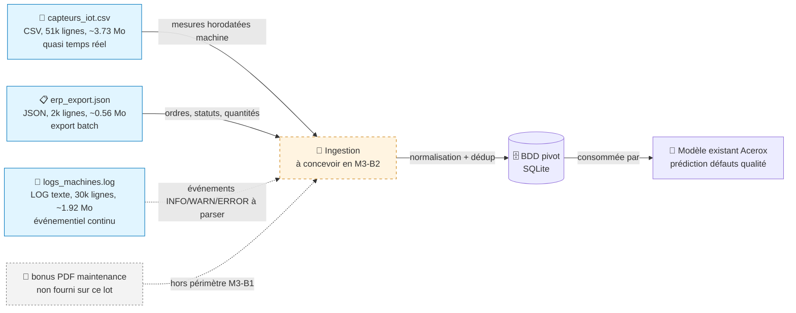

# Schéma des flux de données — Acerox Métallurgie

> Schéma Mermaid à compléter. Doit montrer :
> - **Sources** (capteurs IoT, ERP, logs, *bonus PDF*)
> - **Ingestion** (à concevoir en M3-B2)
> - **BDD pivot** (à modéliser en M3-B2)
> - **Modèle existant** Acerox (placeholder, hors-sujet ici)
>
> Légende explicite : qui produit, qui consomme, contraintes.

## Schéma

## Légende

> Reformule en 5 lignes max ce que le schéma raconte (qui produit quelle
> donnée, qui consomme, contraintes critiques).

- **Producteurs** : ateliers Acerox via capteurs IoT, système ERP et journaux machines.
- **Consommateur final** : le modèle existant de prédiction des défauts qualité, alimenté via la BDD pivot.
- **Chaîne de valeur** : les données brutes convergent vers une ingestion unique puis vers SQLite pour croiser signaux process et contexte ERP.
- **Contraintes critiques** : rythme hétérogène (quasi temps réel vs batch), qualité variable (valeurs manquantes et logs non structurés).
- **Point RGPD** : `ouvrier_id` et certaines traces opérateur doivent être minimisés/pseudonymisés avant exploitation large.

## Décisions associées

- Source(s) retenues en priorité : `capteurs_iot.csv` et `erp_export.json` pour un premier socle prédictif robuste.
- Source(s) écartées : aucune écartée définitivement ; `logs_machines.log` est différée en phase 2 (nécessite parsing/structuration).
- Source bonus (PDF) traitée ? non, aucun PDF exploitable n'a été fourni dans ce lot de données.

---

*Schéma produit par <prénom>, <date>, dans le cadre du brief M3-B1 ATOS.*
